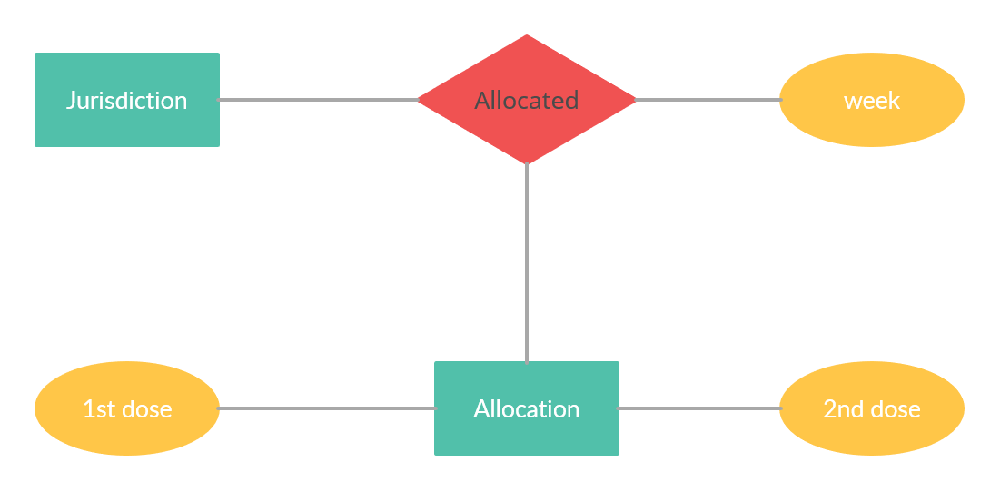

# Apresentação do Lab01 - API Acesso

# Aluno
* `Lucas Otávio Nascimento de Araújo`
* `240106`

## Tarefa 1 sobre APIs de acesso

![Notebook lab01] (https://github.com/Lucas-Otavio/MC536-Banco-de-Dados/tree/main/lab01/notebook/lab01-api.ipynb)

## Tarefa 2 sobre Engenharia Reversa
> 
