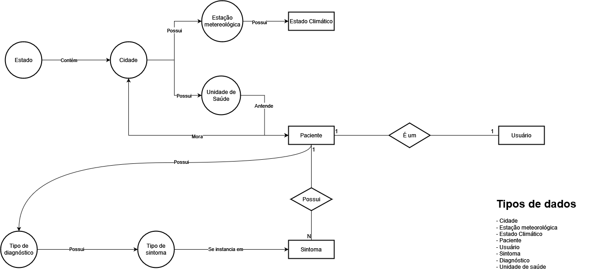

# Lab07 - Modelo Lógico para Banco de Dados de Grafos

## Aluno
* `240106`: `Lucas Otávio Nascimento de Araújo`

## Modelo Lógico do Banco de Dados de Grafos

A imagem inclui uma versão preliminar de todo o Modelo Lógico. As entidades expressas por círculos correspondem às que seriam representadas por grafos.

Estado teria como propriedades seu nome e sigla; cidade, seu nome e estado em que se localiza; estação climática, sua cidade e seus respectivos estados climáticos (que representa o conjunto de dados de temperatura, umidade, vento, qualidade do ar e afins).

Além disso, um Tipo de Diagnóstico possui referências para os Tipos de Sintomas que podem o caracterizar.

## Perguntas de Pesquisa/análise

* Qual o impacto da sazonalidade na incidência de casos de doenças respiratórias?
* Quais são os fatores do tempo atmosférico que afetam os casos de doenças respiratórias?
* É possível antecipar flutuações no número de casos de doenças respiratórias a partir da previsão do tempo?
