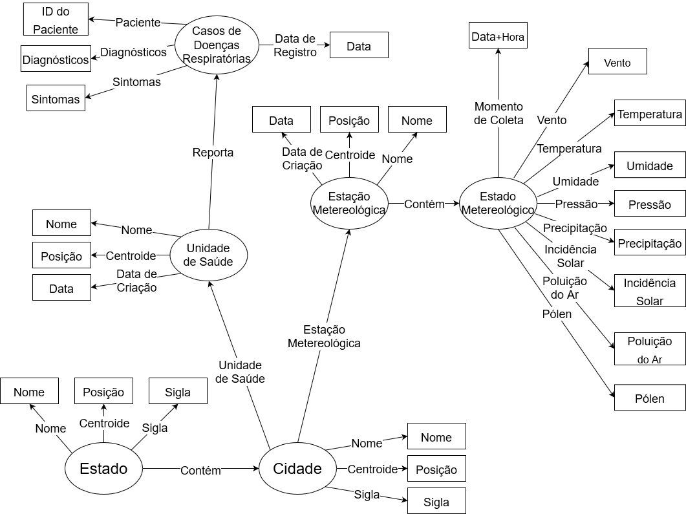

# Lab09 - Grafo de Conhecimento

## Aluno
* `240106`: `Lucas Otávio Nascimento de Araújo`

## Grafo de Conhecimento - para publicar ou enriquecer

## Perguntas de Pesquisa ou Queries

Liste aqui as três perguntas de pesquisa ou queries
* A sazonalidade altera o perfil sintomático médio de um diagnóstico?
* Mudanças atmosféricas bruscas aumentam a incidência, distribuição ou tipo de casos de doenças respiratórias?
* O aumento da presença de pólen ou poluentes pode desencadear crises em pacientes recorrentes?
